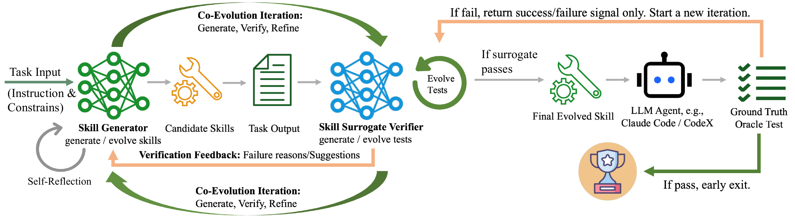
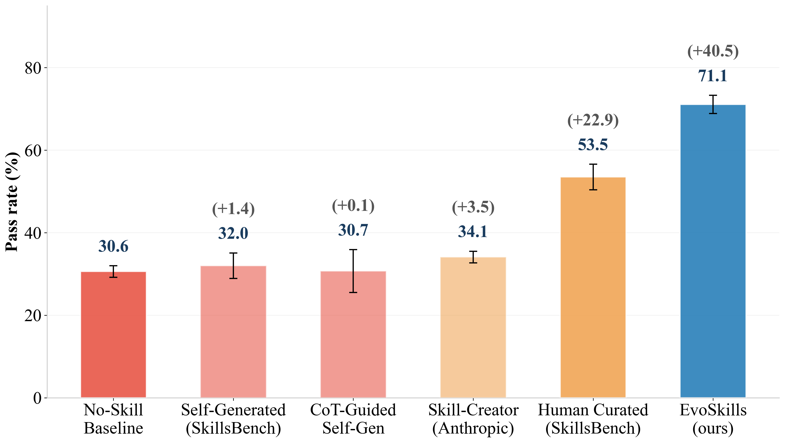
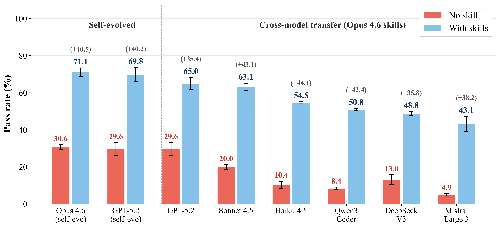
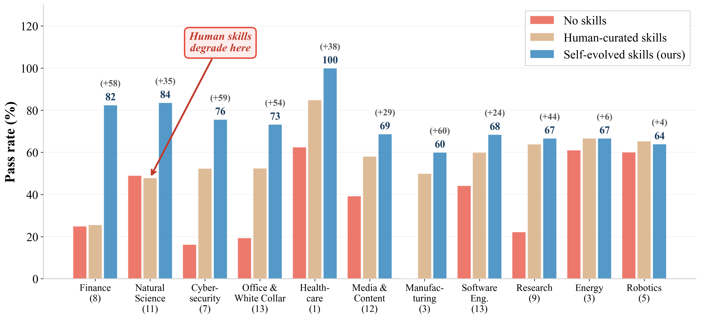
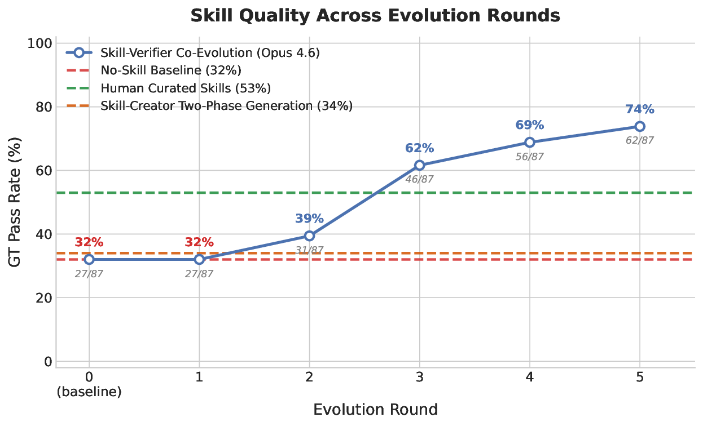

<div align="center">

# 🧬 CoEvoSkills

### Self-Evolving Agent Skills via Co-Evolutionary Verification

[](https://arxiv.org/pdf/2604.01687)
[](https://arxiv.org/abs/2604.01687)
[](https://zhang-henry.github.io/CoEvoSkills/)
[](LICENSE)
[](#)
[](#)

<em>A self-evolving framework that lets LLM agents autonomously construct<br>
complex, multi-file skill packages — no ground-truth supervision required.</em>

</div>

---

## 🔍 What is a Skill?

Anthropic introduced *Agent Skills* as reusable, structured bundles of
multi-file artifacts that let LLM agents tackle multi-step professional
tasks which simple tool invocations cannot address.

<div align="center">
  
  <br/>
  <sub><b>Figure 1.</b> A <i>tool</i> is a single self-contained function; a <i>skill</i> is a structured, multi-file package with instructions, scripts, and assets.</sub>
</div>

Today, skill authoring is label-intensive and suffers from human–machine
cognitive misalignment — degrading downstream agent performance.
**CoEvoSkills** fixes this by letting agents *co-evolve* their own skills
against a surrogate verifier.

---

## ✨ Key Ideas

**CoEvoSkills** couples two components that co-evolve through iterative
*generate – verify – refine* cycles:

- 🛠️ **Skill Generator** — iteratively produces and refines structured
  multi-file skill bundles.
- 🧪 **Surrogate Verifier** — information-isolated; independently evolves
  test assertions to provide dense, actionable failure feedback *without*
  access to ground-truth test content.

A ground-truth oracle returns only an *opaque* pass/fail signal, triggering
test escalation when needed and preserving strict information isolation.

<div align="center">
  
  <br/>
  <sub><b>Figure 2.</b> Overview of the <b>CoEvoSkills</b> co-evolutionary framework. The Skill Generator and Surrogate Verifier co-evolve via iterative refinement; a ground-truth oracle returns only an opaque pass/fail signal, triggering test escalation and preserving information isolation.</sub>
</div>

---

## 🌟 Highlights

- 🧩 **First framework** to produce structured, executable, **multi-file** skill packages via self-evolution — not prompt heuristics or single-function tools.
- 🔒 **No ground-truth supervision** needed during co-evolution; the surrogate verifier supplies dense diagnostic feedback.
- 🏆 **SOTA on SkillsBench** — highest pass rate among five baselines on both **Claude Code** and **Codex**.
- 🌐 **Strong cross-model transferability** to six additional LLMs.

---

## 📊 Results

### Main Results on SkillsBench

<div align="center">
  
  <br/>
  <sub><b>Figure 3.</b> Pass rate on SkillsBench. CoEvoSkills achieves the best performance against five baselines on both Claude Code and Codex.</sub>
</div>

### Cross-Model Transferability

<div align="center">
  
  <br/>
  <sub><b>Figure 4.</b> Skills generated by CoEvoSkills transfer effectively to six additional LLMs without retraining.</sub>
</div>

### Per-Domain Breakdown

<div align="center">
  
  <br/>
  <sub><b>Figure 5.</b> Per-domain pass rate across the 11 SkillsBench domains.</sub>
</div>

### Evolution Trajectory

<div align="center">
  
  <br/>
  <sub><b>Figure 6.</b> Pass rate improves monotonically as the Skill Generator and Surrogate Verifier co-evolve across iterations.</sub>
</div>

---
## 📚 Citation

If you find this work useful, please consider citing:

```bibtex
@article{zhang2026coevoskills,
  title   = {CoEvoSkills: Self-Evolving Agent Skills via Co-Evolutionary Verification},
  author  = {Zhang, Hanrong and Fan, Shicheng and Zou, Henry Peng and
             Chen, Yankai and Wang, Zhenting and Zhou, Jiayu and Li, Chengze and
             Huang, Wei-Chieh and Yao, Yifei and Zheng, Kening and Liu, Xue and
             Li, Xiaoxiao and Yu, Philip S.},
  journal = {arXiv preprint arXiv:2604.01687},
  year    = {2026}
}
```

