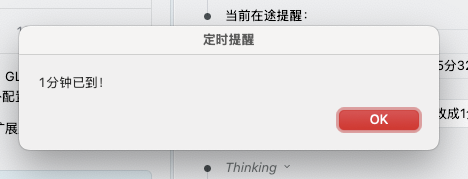

提醒技能。两种模式：

* 中断型：macOS 后台定时提醒 remind-me-skill，在指定时间通过系统通知打断用户。如“明早提醒我签到”。
* 记录型：记录到系统“提醒事项”。如“提醒我阅读这个文章”。

## 理念

工作流中经常需要等待某个时间点（API 限额重置、会议开始、定时休息等），但不想一直盯着时间。这个 Skill 创建一个轻量级后台进程，到时间后通过 macOS 系统对话框强制提醒。

## 示例

```
用户: 报错了，设置提醒：{
    "error": {
      "message": "⚡ 勇士，您的今日冒险体力已耗尽！",
      "details": {
        "recovery_time": "2026-02-14T06:32:36+08:00",
      }
    },
    "advice": "💡 小贴士：合理规划冒险路线，避免在Boss战前耗尽体力！"
  }

AI: 已在后台设置提醒任务：
    - 提醒时间：2026-02-14 06:32:36
    - 提醒内容：冒险体力已恢复！
    
    后台进程 PID: 37802
    如果您想取消提醒，可以运行：kill 37802
```

> 💡 **无论扔什么**：冷却时间 / 会议 / 休息 / 烧水 / 外卖 / 任何时间相关的任务，AI 都能接！

到时间后弹出系统对话框（强制打断，无法忽略）



## 安装和使用

```bash
npx skills add -g Lionad-Morotar/remind-me-skill
```

如果你的 IDE 不支持 SlashCommand，那么为了获得最可靠的结果，需要提示词前加上前缀，比如：

```plaintext
使用 remind-me-skill 技能，10分钟后提醒我开会
```

## 核心功能

- **后台提醒**：使用子 shell + sleep，不阻塞当前 AI 会话
- **任务管理**：自动跟踪在途提醒，存储在 `~/.config/remind-me-skill/tasks/`
- **过期清理**：启动时自动检测并提醒关机期间错过的任务
- **灵活取消**：通过 PID 管理，支持随时取消

## 脚本工具

Skill 提供以下脚本供手动管理：

```bash
# 列出所有在途任务
~/.agents/skills/remind-me-skill/scripts/list_tasks.sh

# 取消指定任务
~/.agents/skills/remind-me-skill/scripts/cancel_task.sh <PID>

# 清理过期任务（自动执行）
~/.agents/skills/remind-me-skill/scripts/cleanup_expired.sh
```

## 技术实现

### 任务存储

任务文件存储在 `~/.config/remind-me-skill/tasks/<timestamp>_<pid>.task`：

```
TITLE=API 限额重置
MESSAGE=您的 API 限额已重置
CREATED_AT=1771021715
TARGET_AT=1771021956
PID=37802
```

### 后台进程

```bash
(sleep $wait_seconds && 
  osascript -e "display dialog \"内容\" with title \"标题\" buttons {\"OK\"} default button 1 giving up after 60" &&
  rm -f $task_file) &
```

### 过期任务处理

系统关机时后台进程会被终止。重启后 Skill 自动检测 `TARGET_AT < 当前时间` 的任务，通过 `display notification` 提醒用户错过的任务。

## 依赖

- macOS 10.10+ （使用 `osascript`）
- Bash 4.0+
